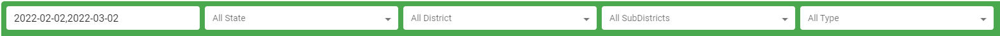
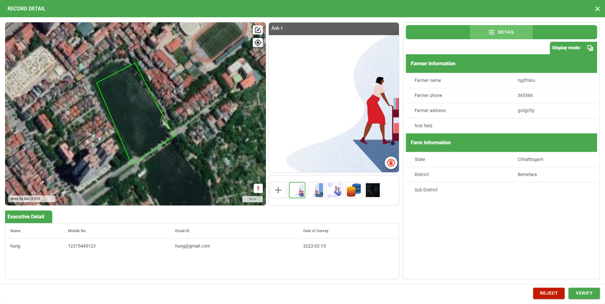

Dashboard
=========

Hiển thị:

* Bộ lọc
* Bản đồ hiển thị vị trí các Farms tương ứng với bộ lọc
* Thống kê bao gồm: Total Farms, Total Farmers, Total Executives, Pending Vertifications, Verified Farms, Total Area (in ha)
* Survey Monitor: Monitor survey by state
* Danh sách Farms: include 4 status (pending, verified, modified, rejected)

.. image:: ../img/dashboard/dashboard.png
    :align: center

Filter
------

Allow users to filter by Date, State, District, SubDistrict, Type.
Sau khi lọc, trên map sẽ hiển thị những farms phù hợp với bộ lọc, phía dưới hiển thị danh sách farms tương ứng và bên phải hiển thị thống kê.

Farms Management 
----------------

Users can search farms by Type or Farmer Name.

Hiển thị danh sách farms ứng với từng trạng thái:

* Pending Farms: Những farms đang ở chế độ pending để verify.
* Verified Farms: Những farms đã được verified.
* Modified Farms: Những farms sau khi tạo đã được truy cập chỉnh sửa nhưng chưa được verified or rejected.
* Rejected Farms: Những farms đã rejected.

Click |record_detail| to view farm detail.

Trong màn hình chi tiết, người dùng được phép sử dụng công cụ để vẽ lại các farm trên map, upload/delete image để có cái nhìn rõ hơn về farm đó và thông tin chi tiết ở bên phải màn hình. 
Bên cạnh đó, người dùng click Reject button to reject farm or Verify button to verify farm. Sau đó các farm sẽ được chuyển sang trạng thái tương ứng ở bên ngoài màn hình dashboard.

.. |display_setting| image:: ../icon/display_setting.png

Click |display_setting| to setting display farms (chọn những trường muốn hiển thị trong list).

Interact map
------------

Người dùng trực tiếp chọn farm trên map để xem thông tin chi tiết. Có những khu vực các farms ở gần nhau nên sẽ được group lại và hiển thị số lượng tổng.