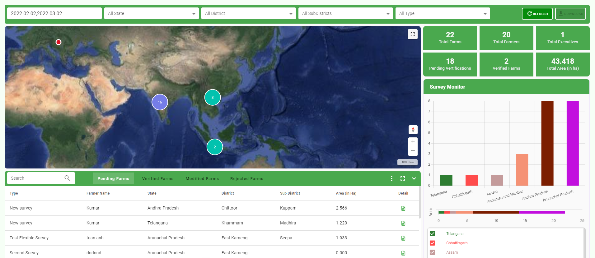

Dashboard
=========

Dashboard page will show:

* Filter
* Map showing the location of Farms corresponding to the filter
* Statistics include: Total Farms, Total Farmers, Total Executives, Pending Vertifications, Verified Farms, Total Area (in ha)
* Survey Monitor: Monitor survey by state
* List of Farms: include 4 status (Pending, Verified, Modified, Rejected)

Filter
------

Allow users to filter by Date, State, District, SubDistrict, Type.
After filtering, the map will display farms that match the filter, the bottom shows a list of corresponding farms and the right shows statistics.

.. image:: ../img/dashboard/filter.png
    :align: center

Farms Management 
----------------

Users can search farms by Type or Farmer Name.

Display a list of farms corresponding to each status:

* Pending Farms: The farms are in pending mode to verify.
* Verified Farms: Verified farms.
* Modified Farms: The farms after creation have been accessed and edited but have not been verified or rejected.
* Rejected Farms: Farms that have been rejected.

.. |record_detail| image:: ../icon/detail_record.png

Click |record_detail| to view farm detail.

.. image:: ../img/dashboard/record_detail.png
    :align: center

In the details screen, the user is allowed to use the tool to redraw the farms on the map, upload/delete image to have a better view of that farm and detailed information on the right side of the screen.
Besides, the user clicks Reject button to reject farm or Verify button to verify farm. Then the farms will be switched to the corresponding state outside the dashboard screen.

Click |display_setting| to setting display farms (select the fields you want to display in the list).

Interact map
------------

Users directly select farm on the map to see detailed information. There are areas where the farms are close together, so they will be grouped and display the total number.