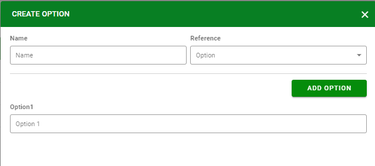
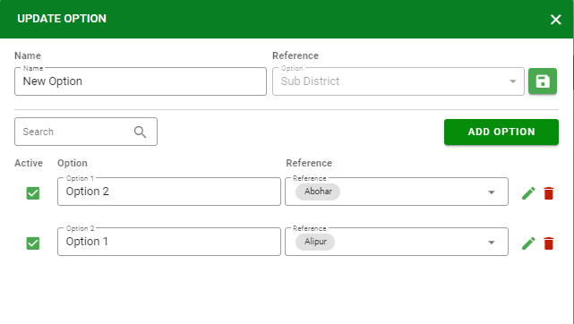

Option Management
=================

Manage options to support Combo Box type in creating Survey.

Create option
-------------

Create a new option to create a field in the survey with the type "Combo Box".

Upload option 
-------------

In addition to manual creation, users can upload files in case there are many options.

.. image:: ../img/option/upload.png
    :align: center

Use Template
------------

Support *.csv, *.xlsx extension.

Update option
-------------

Click |edit_option| icon to edit options including system default options.

Delete option
-------------

.. |delete_option| image:: ../icon/delete_user.png

Click |delete_option| icon to clear options except for the system default options and options that were used in any survey.