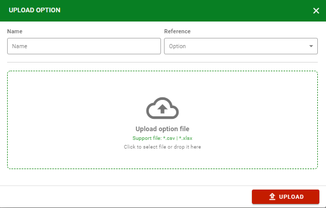

Option Management
=================

Create option
-------------

Tạo option mới để phục vụ cho việc tạo trường trong survey với type là "Combo Box".

.. image:: ../img/option/create_option.png
    :align: center

Upload option 
-------------

Use Template
------------

Support *.csv, *.xlsx extension.

Update option
-------------

Click |edit_option| icon để edit options bao gồm cả những options mặc định của hệ thống.

Delete option
-------------

.. |delete_option| image:: ../icon/delete_user.png

Click |delete_option| icon để xóa options trừ những options mặc định của hệ thống và options đã được sử dụng trong bất kỳ survey nào.