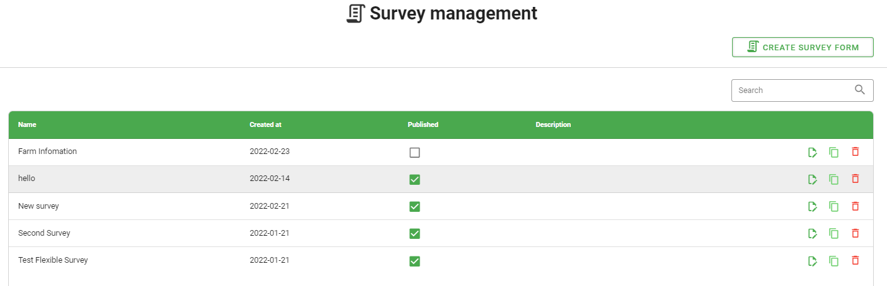

Survey Management
=================

Survey Management include create survey form, edit survey, copy survey and delete survey. Users can search surveys by name. 

Create Survey Form
------------------

.. image:: ../img/survey/create_survey.png
    :align: center

Có những trường thông tin mặc định và người dùng không được phép thay đổi hay xóa trong mọi survey form:

* **Farmer Information**: Name, Phone, Address.
* **Farm Information**: State, District, Sub District.

Ngoài những trường mặc định trên, khi tạo survey form thì người dùng sẽ thêm mới các field trong section tương ứng (thêm vào 1 trong 2 section mặc định đã có hoặc section được tạo mới).
Để tạo mới 1 section thì click "Add new section" button trong mục Section Data.
Sau khi thêm thông tin field thì chọn Section để chứa.

Edit Survey
-----------

.. |edit_survey| image:: ../icon/edit_survey.png

Click |edit_survey| to edit survey. Đối với những survey mà đã có record thì sẽ không thể chỉnh sửa trừ khi phải xóa hết records được tạo trên survey đó.

Copy Survey
-----------

Click |copy_survey| to copy survey. Hệ thống sẽ tạo 1 bản sao của survey đó, người dùng có thể dựa trên bản sao này để thêm mới, chỉnh sửa hay xóa trường nào đó để tạo survey mới.

Delete Survey
-------------

.. |delete_survey| image:: ../icon/delete_user.png

Click |delete_survey| to delete survey. Đối với những survey mà đã có record thì sẽ không thể xóa trừ khi phải xóa hết records được tạo trên survey đó.

