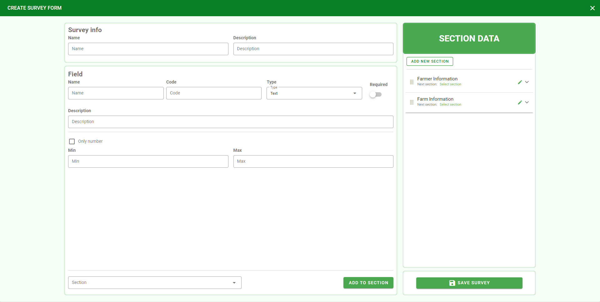

Survey Management
=================

Survey Management include create survey form, edit survey, copy survey and delete survey. Users can search surveys by name. 

.. image:: ../img/survey/survey_1.png
    :align: center

Create Survey Form
------------------

There are default fields and users are not allowed to change or delete in any survey form:

* **Farmer Information**: Name, Phone, Address.
* **Farm Information**: State, District, Sub District.

In addition to the above default fields, when creating a survey form, the user will add new fields in the corresponding section (add one of the two existing default sections or a newly created section).
To create a new section, click the "Add new section" button in the Section Data section.
After adding field information, select the Section to contain.

Type "Combo Box" will be different from other types in that it will be related to Option. Select "Select your option" to select an option in the created Option Management section.

Edit Survey
-----------

.. |edit_survey| image:: ../icon/edit_survey.png

Click |edit_survey| to edit survey. For surveys that already have records, they cannot be edited unless all records created on that survey must be deleted.

Copy Survey
-----------

.. |copy_survey| image:: ../icon/copy_survey.png

Click |copy_survey| to copy survey. The system will create a copy of that survey, users can based on this copy to add new, edit or delete certain fields to create a new survey.

Delete Survey
-------------

Click |delete_survey| to delete survey. For surveys that already have records, they cannot be deleted unless all records created on that survey must be deleted.
