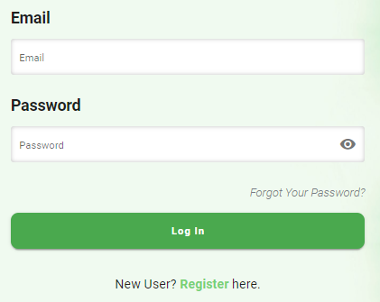
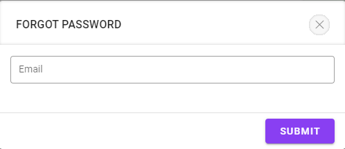

Auth
====

Bao gồm các tính năng: Login, Register, Forgot Password, Update Profile and Logout.

Register
--------

Đăng ký tài khoản bao gồm 2 nhóm thông tin: User Info (Name, Phone Number, Email, Password, Confirm Password), Company Info (Company Name, Country). 
Tài khoản đưọc tạo này sẽ là tài khoản adminstrator và có thể tạo các tài khoản khác để cung cấp cho người dùng trong công ty mình.

.. image:: ../img/user/register.png
    :align: center

Login
-----

Nhập thông tin bao gồm Email và Password đã đăng ký trước đó (đối với adminstrator) hoặc được cung cấp (dashboard, mobile).

Update Profile
--------------

Allow users to update profile include Name, Phone Number and Change Password.
Người dùng click avatar ở góc phải trên cùng của màn hình, hệ thống hiển thị profile để cập nhật.
Để thực hiện thay đổi password thì check vào checkbox "Change password", hệ thống sẽ cho phép người dùng nhập lại password cũ để xác thực.

Forgot Password
---------------

Nếu bạn quên password thì hãy click link "Forgot Your Password?". 
Nhập email để reset lại password.

Logout
------

Click avatar ở góc phải trên cùng màn hình rồi click nút logout để đăng xuất khỏi hệ thống.

