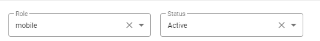
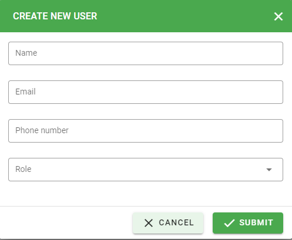

User Management
==============

Administrator manage all users of company. Include create, update, delete user.

Search/Filter
-------------
Allow users to filter by Role, Status and search by Name, Email, Phone number.

Create New User
---------------

Allow users to create new user with two roles:

* **Dashboard**: view dashboard
* **Mobile**:

Type Name, Email, Phone number and Role (dashboard, mobile)

Click Submit button to create new user with above informations.

Update User
-----------

Click |update_user| icon to update user.

Delete User
-----------

Click |delete_user| icon to delete user.