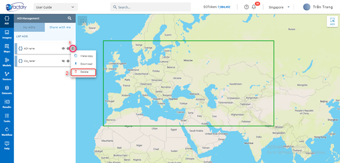

Shared with me
--------------

Tab Share with me show  list AOIs which others shared with the user. To use the AOIs, user need to make copy to my AOI

Make copy
========

User want copy AOI to my AOI

Step 1: Click menu icon -> Click Make copy button

.. image:: ../img/aoi/swm_copy_aoi_1.png
    :align: center 

Step 2: Type name

.. image:: ../img/aoi/swm_copy_aoi_2.png
    :align: center 

Step 3: Click Done button

Download
========

User want to download shared AOI

.. image:: ../img/aoi/swm_download_aoi_1.png
    :align: center 

=> AOI is downloaded and saved as .geojson, file name is AOI name.

Delete
======

User want delete shared AOI

Click menu icon -> Click Delete button

Click Confirm button to delete

.. image:: ../img/aoi/swm_delete_aoi_2.png
    :align: center 